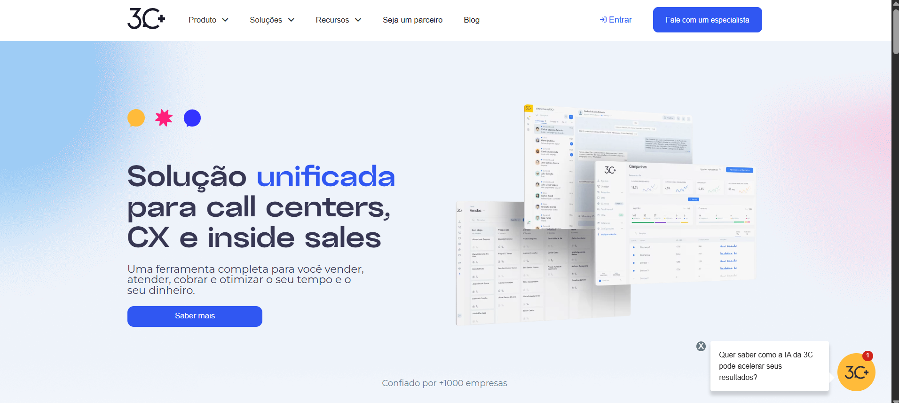

# 3C PLUS website

## Description
This is a custom WordPress website developed for 3C PLUS. The project focused on responsive design, performance optimization, and user-friendly content management.

## Technologies Used
- WordPress
- Elementor
- Advanced Custom Fields (ACF)
- Custom Post Types

## Live Preview
[https://https://3cplusnow.com/](https://3cplusnow.com/)

## My Role
- Full website development
- Performance and SEO optimization
- Third-party tool integration
- Content structure and customization
- Custom theme development
- Custom plugins development
- Custom Widgets development

## Notes
Source code is not publicly available due to client confidentiality, but I'm happy to discuss the development process.
